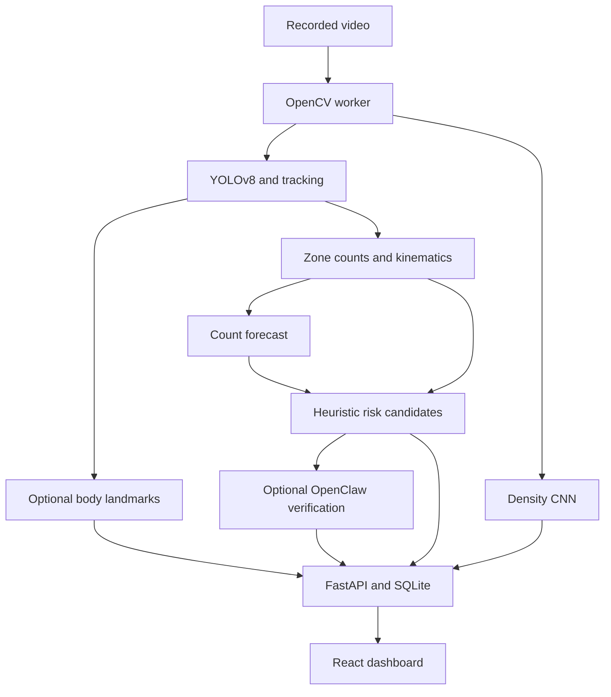

# CrowdShield AI

A working, local research prototype connecting crowd video analysis, two trained
models, a FastAPI backend, SQLite history, and a React operator dashboard.
Built from the software-only proposed system in the supplied project-planning PDF.

**Submission status:** the software pipeline works. Improved accuracy over the
reference papers, stampede prediction, and safety readiness are **not established**.
All displayed counts come from inference; missing models are reported explicitly.

## Start the project

If you received the project ZIP, extract it and open a terminal in the extracted
project folder. Skip the Git clone commands below and proceed to setup.

Install **Python 3.12**, **Node.js 22 or newer**, and Git. Allow several GB of free
disk space for dependencies. First-time setup needs internet; processing is local.

```bash
git clone https://github.com/sasiananth3/Crowdshield-AI.git
cd Crowdshield-AI
```

Windows:

```bat
py -3.12 scripts/bootstrap.py
start.bat
```

Linux/macOS:

```bash
python3.12 scripts/bootstrap.py
.venv/bin/python scripts/run.py
```

Open **http://127.0.0.1:8000**. API documentation is at
**http://127.0.0.1:8000/docs**. Keep the terminal running.
The application is deliberately bound to localhost, with no public deployment or
authentication. Do not expose it to a network without a security review.

Setup creates a local virtual environment, installs CPU inference dependencies,
downloads official YOLOv8 weights and the UMN demonstration video, builds the
dashboard, and runs unit/API tests. The trained density and count-LSTM checkpoints
are included, so **retraining is not required to demonstrate the project**.

### Optional OpenClaw alert verifier

OpenClaw can provide a second opinion only after the local risk engine has produced
a persistent candidate warning. It receives up to three recent frames with the
reviewed zone outlined, plus counts, motion features, forecast and rule reasons.
It cannot change the risk tier. A clear rejection at 85% confidence or higher
suppresses the popup; an inconclusive, malformed, timed-out or failed review keeps
the original warning. Every requested review, including a rejection, is retained
in the `alert_verifications` audit table.

This feature is opt-in because frames leave the computer and are processed by
OpenRouter and the selected free-model provider. Install OpenClaw separately (its
current releases require Node.js 24.16+ or 26.1+; Node 26 is recommended), then
configure an OpenRouter key:

```powershell
iwr -useb https://openclaw.ai/install.ps1 | iex
openclaw models auth login --provider openrouter --method api-key
openclaw infer model run --local --model openrouter/openrouter/free --prompt "Reply with exactly OK" --json
```

Restart CrowdShield after installation, then select **OpenClaw alert
verification** before starting an analysis. The default OpenClaw model reference
is `openrouter/openrouter/free`, which selects OpenRouter's free-model router. The
following optional environment settings are read when CrowdShield starts:

| Variable | Default | Purpose |
|---|---|---|
| `CROWDSHIELD_OPENCLAW_MODEL` | `openrouter/openrouter/free` | OpenClaw provider/model reference |
| `CROWDSHIELD_OPENCLAW_TIMEOUT_SECONDS` | `45` | Per-candidate review timeout (5-180 seconds) |
| `CROWDSHIELD_OPENCLAW_REJECT_CONFIDENCE` | `0.85` | Minimum confidence required to suppress a popup (0.5-1.0) |
| `CROWDSHIELD_OPENCLAW_COMMAND` | discovered from `PATH` | Optional explicit OpenClaw executable path |

The free router may choose different underlying vision-capable models across
requests, so its decisions are not deterministic. This second opinion has not
been shown to improve accuracy; that requires labelled incident/non-incident
evaluation. It must not replace operator review.

Optional body landmarks:

```bat
py -3.12 scripts/bootstrap.py --pose
```

On Linux, OpenCV/MediaPipe may need the operating system's GL/EGL/GLES libraries
(`libgl1`, `libegl1`, `libgles2` on Ubuntu). If they are absent, optional pose output
reports `unavailable`; other modules keep running. Install system dependencies
through your normal package manager. Windows startup instructions are supplied,
but this build was tested on Linux/Python 3.12, not on a Windows computer.

## Five-minute demonstration

1. Click **Load sample video**, or upload authorized MP4/AVI/MOV/MKV/WebM footage.
2. Choose a full-frame zone or left/right zones. Capacity and ground area are
   optional. A demonstration capacity is not a certified venue limit.
3. Choose **Trained LSTM** to demonstrate the experimental forecasting model.
   Persistence is the default because it had lower held-out MAE in this run.
4. Click **Start analysis**. Show detections, independent density-model count,
   heatmap, count history, image-space motion and zone forecasts.
5. Open **Alerts** to acknowledge warnings; **Analyses** to export CSV; and
   **Evaluation** to show actual measured results and their limitations.

For an alert-workflow demonstration, the UMN sample's sustained multi-person
movement can trigger the exploratory motion rule without a capacity value. A
deliberately low reference capacity (for example 10) additionally demonstrates
the experimental occupancy rule. This is a test of software behavior, not evidence
that the footage is dangerous.

## What is implemented

| Proposed component | This implementation |
|---|---|
| Person detection | Official COCO-pretrained YOLOv8n, person class only; ByteTrack IDs |
| Lightweight density estimation | ImageNet MobileNetV2 frozen features plus a trained dilated-convolution head |
| Behavioral signals | Track-local speed, stalling, direction reversals and short-window rapid-dispersal heuristics; optional body-only MediaPipe landmarks |
| Temporal model | Trained 8-sample-input / 3-second-horizon count LSTM, with persistence and linear baselines |
| Fusion and warnings | Explicit occupancy/motion/forecast heuristic, four tiers, persistence and cooldown filters; optional OpenClaw/OpenRouter second opinion |
| Backend and storage | FastAPI REST/WebSocket API, a bounded CPU worker, SQLite analyses and acknowledged alerts |
| Dashboard | Video upload, overlays, zones, trends, warnings, results, provenance and CSV export |

Recorded-video processing is implemented. Webcam/RTSP streams, multi-camera
aggregation, audio/device sensing, a trained pushing/falling classifier, venue
calibration, and automatic physical actions are not implemented. Pose landmarks
are shown when available; the risk score currently uses **bounding-box trajectory
kinematics**, not a validated pose-behavior classifier.

## Measured model results

| Experiment | Held-out MAE | Held-out RMSE | Meaning |
|---|---:|---:|---|
| MobileNetV2 + density head | 19.59 | 33.52 | People per ShanghaiTech Part B image |
| Training-mean count baseline | 71.42 | 95.22 | Sanity check, **not a reference-paper reproduction** |
| Count LSTM | 4.43 | 4.99 | Forecast of YOLO-derived pseudo-counts on one UMN demonstration |
| Persistence forecast baseline | 3.67 | 5.38 | Same chronological holdout as the LSTM |

Density training used 320 images and 80 validation images from the official
400-image training split; testing used the separate official 316-image test split.
Seed 42, 200 epochs; validation MAE selected the checkpoint before test evaluation.
The 256-pixel square resize and short training run limit generalization.

The LSTM used chronological 60/20/20 partitions **before windowing**, excluding
scene-cut windows. The 134/42/42 windows are from one demonstration video and use
detector-generated pseudo-labels, not independent count or incident annotations.
**The LSTM did not beat persistence on MAE.** Neither model has been shown to beat
the papers described in the planning PDF. Counting error is not an "accuracy %".

Full metrics, exact density split filenames, and limitations are in
[reports/density_evaluation.json](reports/density_evaluation.json) and
[reports/forecast_evaluation.json](reports/forecast_evaluation.json).

## Data and reproducible training

| Dataset | Use | Downloaded in this development run |
|---|---|---|
| [ShanghaiTech Part B](https://github.com/desenzhou/ShanghaiTechDataset) | Density training/validation/test | Yes: official archive, only Part B extracted |
| [UMN academic demonstration](https://mha.cs.umn.edu/proj_events.shtml) | Functional video test and count pseudo-labels | Yes: university AVI, not claimed as a labelled incident benchmark |
| [COCO](https://cocodataset.org/) | Provenance of official pretrained detector | Weights only; dataset not downloaded or fine-tuned |

Raw datasets and uploaded footage are excluded from Git. Download directly from
the authors and respect their terms; see [data/README.md](data/README.md).
UCF-QNRF, CrowdHuman, PETS2009 and Indian-context footage are **not** claimed as
training or evaluation sources for this version.

With the virtual environment activated:

```bash
python scripts/download_data.py
python -m training.train_detector
python -m training.extract_counts
python -m training.train_forecast --epochs 150
python -m training.evaluate_density
```

For detector fine-tuning, place images in `data/detector/images/` and matching
YOLO label files in `data/detector/labels/`; nested paths may be used when they
match. Run `python -m training.train_detector --prepare-only` to validate every
image/label pair and generate a deterministic 80/20 split plus
`data/detector.yaml`. Running `train_detector` also performs this preparation
automatically when the YAML is absent. Class `0` must mean person. See
[`data/detector/README.md`](data/detector/README.md) for the exact format.

The downloaded project datasets do not provide person bounding boxes:
ShanghaiTech has point annotations and UMN is an unlabelled demonstration. Pass
`--data`, `--weights`, or `--output` to override the defaults. `extract_counts`
prefers `models/detector.pt` after fine-tuning and otherwise uses the downloaded
`models/yolov8n.pt`.

The included density checkpoint was produced with the separate reproducibility
command `python -m training.train_density --epochs 200 --threads 4`.
`evaluate_density` performs evaluation only and preserves training history in
the existing report. Training commands overwrite the corresponding local
checkpoint and evaluation report, so preserve a copy first if needed. Do not
tune repeatedly against the held-out test set and then report it as untouched.
Dataset receipts and model checksums are recorded in `reports/`.

## Architecture and interfaces



Source directories: `ml/` model adapters and risk logic; `training/` reproducible
training; `backend/app/` API, worker and persistence; `frontend/` dashboard;
`scripts/` setup/download/run tools; `tests/` automated checks; `docs/` methodology.

Main endpoints: `POST /api/videos`, `POST /api/demo`, `GET /api/jobs`,
`POST /api/jobs/{id}/start`, `POST /api/jobs/{id}/stop`,
`GET /api/jobs/{id}/history`, `GET /api/jobs/{id}/frame`,
`GET /api/jobs/{id}/export`, `GET /api/alerts`,
`POST /api/alerts/{id}/acknowledge`, `GET /api/alert-verifications`,
`GET /api/evaluation`,
and `WS /ws/jobs/{id}`. See `/docs` for request schemas and normalized polygons.

## Testing and development

```bash
python -m pytest -q
# Linux/macOS: opt in to the real-model/video integration test
CROWDSHIELD_INTEGRATION=1 python -m pytest -q
cd frontend
npm ci
npm run build
npx playwright install chromium
npm run verify
```

In PowerShell use `$env:CROWDSHIELD_INTEGRATION="1"` before the integration test.
Browser verification starts its own isolated-runtime server on port 8000; stop
the normal app first. It checks sample loading, model inference, heatmap, stop,
alert acknowledgement, evaluation, datasets, CSV and the mobile layout. Temporary
test runtimes may retain sample frames; the script prints their location.

For frontend development, run the backend on port 8000 and `npm run dev` in
`frontend/`; Vite proxies API and WebSocket requests to the backend. After editing,
run `npm run build` before using the single-server dashboard.

## Safety, privacy and next research work

This is academic decision-support software, **not a certified crowd-safety
system**. It must not control gates, evacuation, security or emergency responses.
An operator must review footage and follow the venue's approved procedures.

Detector and density counts describe the same scene and are **never added**.
Ground density is only shown as observed zone count / explicitly supplied area;
no camera calibration is inferred. Risk is not a probability. Missing capacity
leaves occupancy `Uncalibrated`, but sustained multi-person image-space movement
can produce a Moderate warning. The `Safe` tier is only a heuristic label.

No identity embeddings or face-emotion inference are implemented. Original video
and rendered frames can still contain identifiable faces; they are **not blurred
or anonymized**. Uploads, frames, trajectories, counts and alerts stay in the local
`runtime/` folder unless the operator explicitly enables OpenClaw verification.
When enabled, up to three candidate frames are sent through OpenClaw to OpenRouter
and its selected upstream provider; read their current privacy and retention terms
before use. There is no automatic local retention/deletion policy. Only process
authorized footage. Never commit `runtime/` or publish raw data accidentally.

Before claiming improved accuracy: reproduce an appropriate paper baseline on the
same split/preprocessing; obtain independent, labelled crowd recordings; evaluate
false alarms, warning lead time, occlusion and cross-scene generalization; and run
density-only versus kinematics/forecast ablations. See
[docs/EVALUATION_AND_SCOPE.md](docs/EVALUATION_AND_SCOPE.md) and
[docs/THIRD_PARTY.md](docs/THIRD_PARTY.md).
